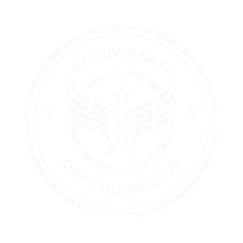

<div align="center">
  
  
  # 🚀 Coding Club IITG
  
  **Interactive 3D Web Experience for IIT Guwahati's Coding Community**
  
  [](#)
  [](#)
  [](#)
  
  [🌐 Live Demo](#) • [📖 Documentation](#features) • [🤝 Contributing](#contributing)
  
</div>

---

## ✨ Features

🎯 **Interactive 3D Cube Navigation** - Navigate through different sections with smooth 3D transitions  
🌓 **Dark/Light Theme Toggle** - Switch between themes for optimal viewing experience  
📱 **Responsive Design** - Works seamlessly across desktop, tablet, and mobile devices  
🎨 **Modern UI/UX** - Clean, intuitive interface with engaging animations  
⚡ **Fast & Lightweight** - Pure vanilla JavaScript, no external dependencies  

## 🎮 Navigation

| Icon | Section | Description |
|------|---------|-------------|
| 🏠 | **Home** | Welcome page and club overview |
| 📅 | **Events** | Weekly coding sessions and special events |
| 💻 | **Projects** | Collaborative coding projects and showcases |
| ℹ️ | **About** | Mission, vision, and team information |
| 📚 | **Resources** | Learning materials, tutorials, and tools |
| 📧 | **Contact** | Get in touch with the team |

## 🚀 Quick Start

1. **Clone the repository**
   ```bash
   git clone https://github.com/Vjalaj/Coding-Club_IITG.git
   cd Coding-Club_IITG
   ```

2. **Open in browser**
   ```bash
   # Simply open index.html in your preferred browser
   # Or use a local server for best experience
   python -m http.server 8000
   # Then visit http://localhost:8000
   ```

3. **Start exploring!** 🎉

## 📁 Project Structure

```
Coding-Club_IITG/
├── 📄 index.html          # Main HTML file
├── 🎨 styles.css          # CSS styles and animations
├── ⚡ script.js           # JavaScript functionality
├── 📁 assets/             # Images and media files
│   ├── Logo.jpg           # Club logo (light theme)
│   └── dark_logo.jpg      # Club logo (dark theme)
└── 📖 README.md           # Project documentation
```

## 🛠️ Technologies Used

- **HTML5** - Semantic markup and structure
- **CSS3** - Styling, animations, and 3D transformations
- **Vanilla JavaScript** - Interactive functionality and DOM manipulation
- **CSS Grid & Flexbox** - Responsive layout system

## 🎨 Customization

### Theme Colors
Edit the CSS custom properties in `styles.css`:
```css
:root {
  --primary-color: #your-color;
  --secondary-color: #your-color;
  --background-color: #your-color;
}
```

### Adding New Sections
1. Add a new cube face in `index.html`
2. Update the navigation in the header
3. Add corresponding styles in `styles.css`
4. Update JavaScript event handlers in `script.js`

## 🤝 Contributing

We welcome contributions from the IITG community! Here's how you can help:

1. 🍴 **Fork** the repository
2. 🌿 **Create** a feature branch (`git checkout -b feature/amazing-feature`)
3. 💾 **Commit** your changes (`git commit -m 'Add amazing feature'`)
4. 📤 **Push** to the branch (`git push origin feature/amazing-feature`)
5. 🔄 **Open** a Pull Request

### Development Guidelines
- Follow semantic HTML structure
- Use CSS custom properties for theming
- Keep JavaScript modular and well-commented
- Test across different browsers and devices
- Maintain accessibility standards

## 📱 Browser Support

| Browser | Version | Status |
|---------|---------|--------|
| Chrome | 60+ | ✅ Fully Supported |
| Firefox | 55+ | ✅ Fully Supported |
| Safari | 12+ | ✅ Fully Supported |
| Edge | 79+ | ✅ Fully Supported |

## 📄 License

This project is licensed under the MIT License - see the [LICENSE](LICENSE) file for details.

## 🏫 About IITG Coding Club

The Coding Club at IIT Guwahati is a vibrant community of passionate programmers, developers, and tech enthusiasts. We organize regular coding sessions, hackathons, workshops, and collaborative projects to foster learning and innovation.

### 🎯 Our Mission
- Promote coding culture at IIT Guwahati
- Provide a platform for collaborative learning
- Bridge the gap between academic knowledge and industry skills
- Foster innovation through hands-on projects

---

<div align="center">
  
  **Made with ❤️ by the IITG Coding Club Community**
  
  ⭐ Star this repo if you found it helpful!
  
</div>